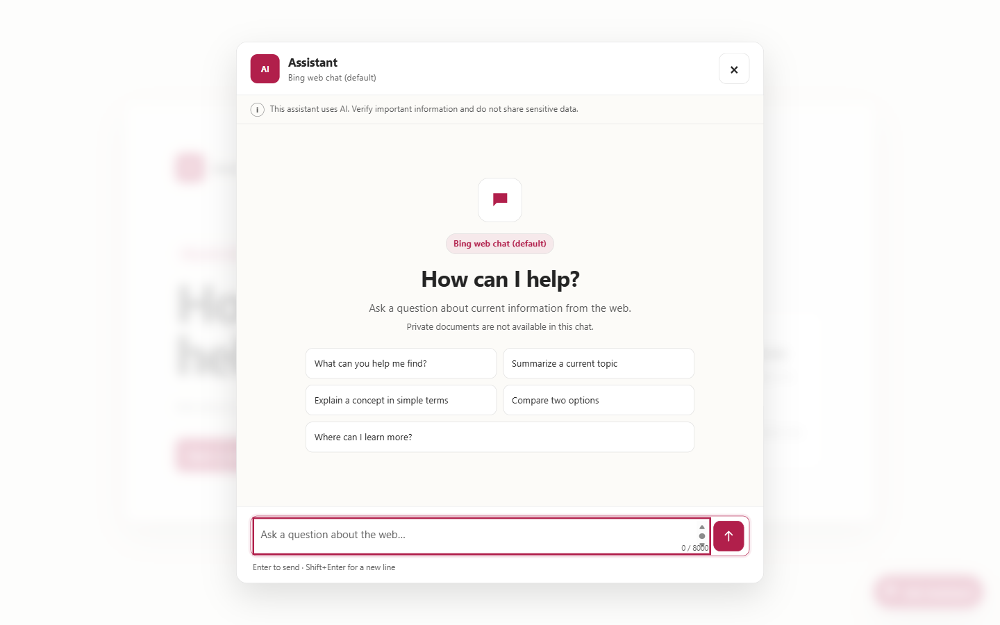
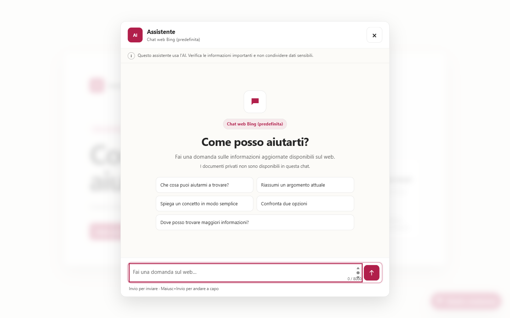

# Azure Bing Assistant

[English](#english) · [Italiano](#italiano)

> **Independent project / Progetto indipendente.** Azure Bing Assistant is not an official Microsoft product and is not approved,
> sponsored, or maintained by Microsoft. Azure, Bing, and other Microsoft
> product names are trademarks of their respective owners. The project is
> licensed under [MIT](LICENSE); see also [`NOTICE`](NOTICE).
>
> Azure Bing Assistant non è un prodotto Microsoft ufficiale e non è approvato,
> sponsorizzato o mantenuto da Microsoft. Azure, Bing e gli altri nomi di prodotti
> Microsoft sono marchi dei rispettivi titolari. Licenza [MIT](LICENSE);
> vedere anche [`NOTICE`](NOTICE).

<a id="english"></a>

## English

### Your authorized websites, a conversation. Your choice of model.

Help students, applicants, and staff navigate public university information
with a web chatbot in your Azure environment. **Azure Bing Assistant** pairs
domain-filtered, Bing-backed native `web_search` with a compatible model you
choose in Microsoft Foundry:
start from the web without first building a document index.

Designed for **universities internationally whose public portals change
frequently**: admissions, deadlines, programmes, student services, and
regulations evolve throughout the academic year. Bing web grounding is a useful
fit because it can retrieve indexed public pages rather than requiring a
separate knowledge base duplicating the university's portal content. This can
reduce duplicated content maintenance, not eliminate source governance.
A chat can simplify discovery and potentially reduce repetitive questions to
service desks; it does not replace staff or official communications.

**Not instant synchronization:** Bing indexing and source availability can lag;
coverage and crawling completeness are not guaranteed. Authenticated pages are
not searchable through this public-web path. Check citations and dates on the
authoritative university pages: those pages, not chat answers, govern deadlines.

**[Follow the installation guide](#quick-install-en)** ·
**[Customize your chat](docs/configuration.md#customization-en)** ·
**[Explore the cost estimate](docs/configuration.md#indicative-monthly-estimate-en)**

### Why choose it

- **Start with information on authorized websites.** Bing can search authorized public content
  and provide citations to its sources: no document collection is required to
  start with the base mode.
- **Choose your reference model, not a fixed trade-off.** The wizard offers
  models, versions, and SKUs available in your region/subscription. Evaluate
  Foundry- and Bing-compatible models to balance answer quality, latency, and
  budget. A listed model does not guarantee Bing compatibility: check tools,
  region, and quota before deployment. Changing models later requires
  configuration/provisioning, not a dropdown in the chat.
- **Bring the assistant into your website.** Customize names, welcome text, and
  suggestions without frontend changes; adapt styling and embed the page via
  iframe. An administrator selects one of nine complete installer and frontend
  languages, including Hebrew and Arabic right-to-left layouts. Italian remains
  the default for compatibility.
- **Add documents only when needed.** The optional Azure AI Search path
  complements Bing with administrator-uploaded and indexed documents, at
  additional cost: there is no file upload in the chat.
- **Manage resources and budgets in your tenant.** The backend uses Managed
  Identity and exposes no model API keys in the browser. Access, API
  protection, and consumption controls remain your decisions.

### Indicative monthly estimate

**About USD 149.13/month for 1,000 conversations of five question-answer turns.**
This estimate uses the assumptions documented in the guide; actual cost depends
on usage. It includes the $13.14 B1 fixed cost; optional Search, taxes, and other
items are excluded.
[See the estimate's assumptions and details](docs/configuration.md#indicative-monthly-estimate-en).

**Quick links:** [install](#quick-install-en) · [use](#use-en) ·
[access and responsibilities](#access-en) ·
[cost estimate](docs/configuration.md#cost-estimate-en) ·
[visual customization](docs/configuration.md#customization-en) ·
[embed in your website](docs/configuration.md#embed-chat-en) ·
[architecture](docs/architecture.md#english)

### Preview




**Earlier illustrations:** screenshots and graphs still show old labels and the
standalone Bing resource/connection. Current code uses filtered `web_search`
without that resource; see the [updated architecture](docs/architecture.md).

More Italian-default views: [document mode (illustrative local
demonstration)](docs/assets/chat-search-desktop.png) ·
[mobile](docs/assets/chat-mobile.png) · [dark theme](docs/assets/chat-dark.png) ·
[operational flow](docs/assets/flow-en.svg).

All screenshots are locally rendered examples, not evidence of a live Bing,
Foundry, or tenant deployment. Any displayed responses are synthetic; no
displayed answer, source, or information demonstrates a real result.

### Nine interface and installer languages

| Code | Language | Native label | Layout |
|---|---|---|---|
| `it` | Italian (default) | Italiano | LTR |
| `en` | English | English | LTR |
| `fr` | French | Français | LTR |
| `es` | Spanish | Español | LTR |
| `pt` | European Portuguese | Português | LTR |
| `el` | Greek | Ελληνικά | LTR |
| `he` | Hebrew (Israel) | עברית | RTL |
| `ar` | Arabic | العربية | RTL |
| `tr` | Turkish | Türkçe | LTR |

Choose a language in the wizard or set `UI_LANGUAGE=fr`/`--ui-language fr`,
using any code above. The selection controls the **full installer and frontend**:
questions, help, summaries, progress, confirmations, UI controls, accessibility
copy, and generated citation labels. Yes/no prompts accept native answers.
Hebrew and Arabic use right-to-left (RTL) frontend layout; URLs and technical identifiers
remain readable left-to-right.

On Windows, the Python CLI uses UTF-8 for stdin/stdout/stderr, including
redirected output, without user environment configuration. Older PowerShell
pipeline consumers should read UTF-8. Terminal font and bidirectional support
vary; RTL terminal layout is not guaranteed.

Italian remains the default; existing `it`/`en` menu entries and saved
configurations stay compatible. Nine packaged catalogs in
`src/azure_bing_assistant/locales` and a central registry provide the shared
translations; the frontend is generated from the same catalogs.
This is administrator configuration, not a per-visitor language selector.
Custom text and provider-supplied source titles are not automatically translated.
The model is still instructed to respond in the **user's language**, independently
of the interface language. See [language configuration and native inputs](docs/configuration.md#languages).
Documentation remains primarily English with an Italian guide, not nine complete
documentation translations. Packaged language support is not evidence that any
existing live deployment has been upgraded or verified in all nine languages.

### Two modes, one chat

| Experience | Technical value | Resources |
|---|---|---|
| **Authorized websites (default)** | `off` | Foundry, model, Bing web-search consumption, App Service |
| **Authorized websites + managed documents** | `searchBlob` | Everything above, plus Blob Storage and Azure AI Search |

`off` means only **document search off**: Bing and chat remain enabled.
`searchBlob` does not replace Bing, costs more, and makes documents available
only after an administrator uploads them outside the chat, indexes them, and
verifies the indexer. The chat has no attachments, upload, source picker, or
user-facing mode switch.

`--websites` / `WEB_GROUNDING_SITES` are required: up to 100 domains, including
subdomains, not paths. The typed tool sends `web_search.filters.allowed_domains`;
there is no unfiltered fallback. `--strict-websites` is a compatibility alias:
restriction is always required. Runtime verifies and pins an agent version,
checks consulted-source metadata, and rejects unverifiable results.
**Live model/region acceptance and enforcement, including `open_page`, require
manual verification.** Offline tests do not prove remote fetch behavior or the
correctness of every statement.

The wizard collects one domain, asks whether to include subdomains, then whether
to add another. **No to subdomains blocks installation before terms and Azure
writes:** the native engine always includes descendants, so “only this host”
is unsupported and is never converted to Yes. The chatbot language also controls
the entire installer. See the [domain-policy examples](docs/configuration.md#domains-one-at-a-time)
and [native yes/no inputs for all nine languages](docs/configuration.md#languages);
manually restart an already open wizard to load the updated code.

Formats, limits, and defaults appear before you answer. Invalid menu choices,
names, capacity, or domains repeat only the affected field, preserving earlier
answers. Chatbot and installation technical names require 3–24 lowercase letters,
digits or hyphens, starting with a letter (e.g. `assistant-demo`); public labels
with spaces are configured separately. Ctrl+C/EOF cancels; terms and final
approval still default to No.

The interactive installer saves valid answers incrementally in
`.azure/installer-draft.json`, a **private local plaintext file**, excluded from
Git. After a failure, run `install` again: Enter reuses displayed values,
revalidated against current Azure choices. Credentials, Bing terms and final
approval are never saved; both consents always require a fresh Yes.
`python -m azure_bing_assistant install --reset-wizard` removes only this draft.
It is automatically cleared only after successful full application deployment;
it is not chat conversation storage. Answers from failures before this change
cannot be recovered unless a draft already existed.

After final approval, `install` shows five real phases on **stderr**, for example
`Phase 2/5 · Provisioning Azure resources · in progress · 01:15`.
A terminal animates an activity indicator; redirected output uses plain lines
and a heartbeat every 30 seconds. These are not percentages or completion estimates.
Ctrl+C stops the local wait, **not** remote Azure operations.
Capacity help gives illustrative PAYG test **10** / production **100** unit
examples within SKU bounds; a valid saved value, including **1000**, is never
automatically replaced. Actual TPM/RPM ratios and peak load still need verification.
See [capacity and progress](docs/configuration.md#capacity-and-progress-en).

<a id="quick-install-en"></a>

### Quick install for administrators

Prerequisites: Windows PowerShell, Python 3.11 or 3.12, Git, Azure CLI, Azure
Developer CLI, an Azure subscription with suitable quota and roles, and
`az`/`azd` access to the same tenant.

From PowerShell:

```powershell
git clone https://github.com/natasso/azure-bing-assistant.git
Set-Location .\azure-bing-assistant
py -3.12 -m venv .venv
.\.venv\Scripts\Activate.ps1
python -m pip install -e .
az login
azd auth login
python -m azure_bing_assistant doctor
python -m azure_bing_assistant install
```

If only Python 3.11 is available, replace the environment-creation command with
`py -3.11 -m venv .venv`; all following commands remain unchanged.

The public repository can be cloned without GitHub authentication. The wizard
reads subscriptions, resource groups, regions, model/SKU combinations, and roles
from Azure, shows a plan, and asks before changing Azure. Answer **No** to optional
document search for the simpler, lower-cost path.

Visitors need no client ID, application registration, or Entra login. Operator
Azure access and the backend Managed Identity remain required. See
[Configuration](docs/configuration.md#english) for dry-run, non-interactive
installation, and document setup.

<a id="use-en"></a>

### Use

An end user opens the organization-provided URL, starts a conversation, and
types a question. They do not install the repository or complete a second
application-managed login. The browser sends text to FastAPI and keeps only the
latest opaque response identifier in memory to continue the conversation.

Hypothetical prompts include “Where is the current admissions timetable?”,
“Which programmes are listed for the next academic year?”, “Where can I find
student support contacts?”, and “Which official page contains the assessment
regulations?” Always verify the content, date, and source before acting.

### Trust the sources, not automatic promises

Bing is a tool available to the agent: not every answer involves a search,
and completeness, accuracy, or freshness are not guaranteed.
Indexing and availability may lag behind portal changes; public search cannot
retrieve authenticated pages and does not guarantee complete crawling.
Open the supplied citations and check dates and content against official
sources; URLs written by the model in answer text may be wrong. Do not treat
the chat as confirmation of deadlines or procedures: authoritative university
pages govern them. Do not enter sensitive data.

<a id="access-en"></a>

### Access, costs, and project status

A new installation exposes the UI, `/api/chat`, and other App Service endpoints.
The customer decides and applies any protection to the complete website and API
ingress. Protecting only an embedding page does not protect direct calls. CORS
and `Referer` are not access controls. Removing template-managed Easy Auth does
not automatically disable policies already present on an existing deployment.

Each request can incur model and Bing usage charges. The
[reproducible public estimate](docs/configuration.md#cost-estimate-en), retrieved
on September 7, 2026, uses USD list prices, five turns per conversation, and
separates ongoing B1 cost from variable usage. It includes both a planning
assumption and the non-predictive extrapolation of one synthetic live smoke test
dated September 8, plus an indicative monthly estimate using a hypothetical
variable budget. `searchBlob` adds Storage and Search. For broad access, the
customer must select suitable limits, budgets, monitoring, and abuse controls.
The project does not install a gateway, WAF, CAPTCHA, or rate limiter and gives
no compliance or geographic-residency guarantee for Bing processing.

This code is a template to validate in the target tenant, not a claim of
production readiness or a proven live deployment. Verify quota, regional
availability, model/tool compatibility, terms, privacy, accessibility, load,
and organizational policy. See [Security](docs/security.md#english) and
[Roadmap](docs/roadmap.md#english).

### Detailed guides

- [Configuration, installation, and visuals](docs/configuration.md#english)
- [UI, bubbles, and embedding in your website](docs/configuration.md#customization-en)
- [Architecture and flows](docs/architecture.md#english)
- [Security design](docs/security.md#english)
- [Roadmap and tenant verification](docs/roadmap.md#english)
- [Vulnerability reporting](SECURITY.md#english)

---

<a id="italiano"></a>

## Italiano

### I tuoi siti autorizzati, una conversazione. Il modello che scegli.

Aiuta studenti, candidati e personale a orientarsi tra informazioni pubbliche,
servizi e contatti con un chatbot web nel tuo ambiente Azure.
**Azure Bing Assistant** unisce ricerca nativa `web_search` filtrata per dominio
(basata su Bing) a un modello compatibile in Microsoft Foundry:
puoi partire dal web senza costruire prima un indice documentale.

Pensato per **università di qualsiasi paese con portali pubblici che cambiano
frequentemente**: ammissioni, scadenze, corsi di studio, servizi agli studenti e
regolamenti evolvono durante l'anno accademico. Il grounding web con Bing può
recuperare pagine pubbliche indicizzate, riducendo la necessità di duplicare i
contenuti del portale in una knowledge base separata e mantenerne copie.
Non elimina la responsabilità sulle fonti. Una chat può semplificare la ricerca
e potenzialmente ridurre le domande ripetitive rivolte agli sportelli;
non sostituisce il personale né le comunicazioni ufficiali.

**Non è una sincronizzazione istantanea:** indicizzazione Bing e disponibilità
delle fonti possono essere in ritardo; copertura e scansione completa non sono
garantite. Le pagine autenticate non sono ricercabili tramite questo percorso web
pubblico. Verificare citazioni e date: per le scadenze fanno fede le pagine
ufficiali dell'università, non le risposte della chat.

**[Segui la guida di installazione](#installazione-rapida-it)** ·
**[Personalizza la tua chat](docs/configuration.md#personalizzazione-it)** ·
**[Consulta la stima dei costi](docs/configuration.md#stima-mensile-indicativa-it)**

### Perché sceglierlo

- **Parti dalle informazioni nei siti autorizzati.** Bing può cercare contenuti pubblici autorizzati
  e fornire citazioni per risalire alle fonti: non devi preparare un archivio di
  documenti per iniziare con la modalità base.
- **Scegli il modello di riferimento, non un compromesso fisso.** Il wizard
  propone modelli, versioni e SKU disponibili nella tua regione/sottoscrizione.
  Valuta i modelli compatibili con Foundry e Bing per bilanciare qualità delle
  risposte, latenza e budget. Un modello elencato non garantisce compatibilità
  con Bing: verifica strumenti, regione e quota prima del deploy. Cambiarlo
  successivamente richiede configurazione/provisioning, non un menu nella chat.
- **Porta l'assistente nel tuo sito.** Personalizza nomi, benvenuto e
  suggerimenti senza modificare il frontend; adatta lo stile e incorpora la
  pagina via iframe. L'amministratore sceglie fra nove lingue complete per
  installer e frontend, con layout RTL per ebraico e arabo. L'italiano resta
  il valore predefinito per compatibilità.
- **Aggiungi documenti solo quando servono.** Il percorso opzionale con Azure
  AI Search affianca a Bing documenti caricati e indicizzati dall'amministratore,
  con costi aggiuntivi: nessun caricamento di file nella chat.
- **Gestisci risorse e budget nel tuo tenant.** Il backend usa Managed Identity
  e non espone chiavi API del modello nel browser. Restano tue le decisioni su
  accesso, protezione delle API e controllo dei consumi.

### Stima mensile indicativa

**Circa 149,13 USD/mese per 1.000 conversazioni da cinque scambi domanda-risposta.**
Importo stimato in base alle ipotesi riportate nella guida; il costo effettivo
dipende dall'uso. Include il fisso B1 di $13,14; Search opzionale, imposte e altre
voci sono esclusi.
[Consulta ipotesi e dettagli della stima](docs/configuration.md#stima-mensile-indicativa-it).

**Link rapidi:** [installazione](#installazione-rapida-it) ·
[uso](#uso-it) · [accesso e responsabilità](#accesso-it) ·
[stima costi](docs/configuration.md#stima-costi-it) ·
[personalizzazione grafica](docs/configuration.md#personalizzazione-it) ·
[chat nel proprio sito](docs/configuration.md#incorporare-chat-it) ·
[architettura](docs/architecture.md#italiano)

### Anteprima




**Illustrazioni precedenti:** screenshot e grafi mostrano ancora le vecchie etichette
e la risorsa/connessione Bing standalone. Il codice attuale usa `web_search` filtrato
senza tale risorsa; vedere [architettura aggiornata](docs/architecture.md).

Altre viste: [modalità documenti (dimostrazione locale
illustrativa)](docs/assets/chat-search-desktop.png) ·
[mobile](docs/assets/chat-mobile.png) · [tema scuro](docs/assets/chat-dark.png) ·
[flusso operativo](docs/assets/flow-it.svg).

Tutti gli screenshot sono esempi renderizzati localmente, non prove di una
distribuzione Bing, Foundry o tenant attiva. Eventuali risposte mostrate sono
sintetiche; nessuna risposta, fonte o informazione mostrata dimostra un risultato
reale.

L'interfaccia completa è **italiana per impostazione predefinita**. Il wizard,
`UI_LANGUAGE` e `--ui-language` accettano `it`, `en`, `fr`, `es`, `pt`, `el`,
`he`, `ar`, `tr`: italiano, inglese, francese, spagnolo, portoghese europeo,
greco, ebraico (Israele), arabo e turco. La scelta localizza l'intero installer,
frontend e le etichette di citazione generate; le domande sì/no accettano risposte
native. Ebraico e arabo usano layout frontend da destra a sinistra (RTL).
Su Windows il CLI Python usa UTF-8 per stdin/stdout/stderr, anche con output
reindirizzato, senza configurare variabili d'ambiente. I programmi che leggono
le pipe delle vecchie versioni di PowerShell devono leggere UTF-8. Font e supporto
bidirezionale dipendono dal terminale: il layout RTL nel terminale non è garantito.
Le voci di menu e configurazioni `it`/`en` restano compatibili.
I nove cataloghi in `src/azure_bing_assistant/locales` e il registro centrale
sono condivisi; il frontend viene generato dagli stessi cataloghi.
Non è un selettore per visitatore e non traduce testi personalizzati o titoli
delle fonti del provider. Il modello resta istruito a rispondere nella
**lingua dell'utente**, indipendentemente dalla UI.
Vedere [lingue e risposte native](docs/configuration.md#languages).
Il supporto nel pacchetto non dimostra che un'installazione live esistente sia
stata aggiornata o verificata in tutte le nove lingue.

### Due modalità, un'unica chat

| Esperienza | Valore tecnico | Risorse |
|---|---|---|
| **Siti autorizzati (predefinita)** | `off` | Foundry, modello, consumo web search Bing, App Service |
| **Siti autorizzati + documenti gestiti** | `searchBlob` | Tutto quanto sopra, più Blob Storage e Azure AI Search |

`off` significa soltanto **ricerca documentale disattivata**: Bing e la chat
restano attivi. `searchBlob` non sostituisce Bing, costa di più e rende i
documenti disponibili solo dopo che un amministratore li ha caricati fuori
dalla chat, indicizzati e verificati. La chat non offre allegati, upload,
selettori di fonti o un cambio modalità per l'utente.

`--websites` / `WEB_GROUNDING_SITES` sono obbligatori: massimo 100 domini,
inclusi i loro sottodomini, non percorsi. Lo strumento tipizzato invia
`web_search.filters.allowed_domains`; non esiste fallback web senza filtro.
`--strict-websites` resta un alias di compatibilità: il filtro è sempre richiesto.
Il runtime verifica e fissa la versione agente e controlla i metadati delle fonti,
rifiutando risultati non verificabili. **Accettazione/enforcement live per modello
e regione, incluso `open_page`, restano da verificare manualmente.** I test offline
non provano fetch remoti né correttezza di ogni affermazione.

Il wizard raccoglie un dominio alla volta, chiede se includere i sottodomini e
poi se aggiungerne un altro. **No ai sottodomini blocca l'installazione prima dei
termini e delle scritture Azure:** il motore nativo include sempre i sottodomini,
quindi «solo questo host» non è supportato e non viene trasformato in Sì.
La lingua scelta per il chatbot controlla anche l'intero installer.
Vedere gli [esempi di policy](docs/configuration.md#domini-uno-alla-volta) e le
[risposte native nelle nove lingue](docs/configuration.md#languages);
riavviare manualmente un wizard già aperto per caricare il codice aggiornato.

Formato, limiti e valori predefiniti sono mostrati prima delle risposte.
Errori di menu, nomi, capacità o domini ripropongono solo il campo da correggere,
conservando le risposte precedenti. I nomi tecnici di chatbot e installazione
richiedono 3–24 lettere minuscole, cifre o trattini, iniziando con una lettera
(es. `assistente-demo`): il titolo pubblico con spazi si configura separatamente.
Ctrl+C/EOF annulla; termini e conferma finale mantengono No come predefinito.

L'installer interattivo salva progressivamente le risposte valide in
`.azure/installer-draft.json`, **file locale in chiaro da tenere privato**, escluso
da Git. Dopo un errore, rieseguire `install`: Invio riusa i valori mostrati,
riconvalidati contro le scelte Azure attuali. Credenziali, termini e conferma
finale non sono salvati: i due consensi richiedono sempre un nuovo Sì.
`python -m azure_bing_assistant install --reset-wizard` elimina solo questa bozza.
La bozza si cancella automaticamente solo dopo la distribuzione completa riuscita;
non è memoria delle conversazioni. Le risposte di errori precedenti a questa
modifica non sono recuperabili se non esisteva già una bozza.

Dopo il Sì finale, `install` mostra su **stderr** cinque fasi reali con attività
ed elapsed, ad esempio `Fase 2/5 · Creazione delle risorse Azure · in corso · 01:15`.
Il terminale anima un indicatore; output reindirizzato usa righe semplici e un
segnale ogni 30 secondi. Non sono percentuali o stime di completamento.
Ctrl+C interrompe l'attesa locale, **non** annulla le operazioni Azure.
Prima della capacità: esempi PAYG test **10** / produzione **100** unità, solo
illustrativi entro i limiti SKU; nessuna sostituzione automatica di un valore
salvato valido, anche **1000**. Rapporti TPM/RPM e carico reale vanno verificati.
Vedi [capacità e avanzamento](docs/configuration.md#capacita-e-avanzamento-it).

<a id="installazione-rapida-it"></a>

### Installazione rapida per amministratori

Prerequisiti: Windows PowerShell, Python 3.11 o 3.12, Git, Azure CLI, Azure
Developer CLI, una sottoscrizione Azure con quota e ruoli adeguati e accesso
`az`/`azd` allo stesso tenant.

Da PowerShell:

```powershell
git clone https://github.com/natasso/azure-bing-assistant.git
Set-Location .\azure-bing-assistant
py -3.12 -m venv .venv
.\.venv\Scripts\Activate.ps1
python -m pip install -e .
az login
azd auth login
python -m azure_bing_assistant doctor
python -m azure_bing_assistant install
```

Se è disponibile soltanto Python 3.11, sostituire il comando di creazione
dell'ambiente con `py -3.11 -m venv .venv`; i comandi successivi restano uguali.

Il repository pubblico può essere clonato senza autenticazione GitHub. Il wizard
legge da Azure sottoscrizioni, gruppi, regioni, modelli/SKU e ruoli, mostra il piano
e chiede conferma prima di modificare Azure. Per il percorso più semplice e meno
costoso, rispondere **No** alla ricerca documentale opzionale.

Non servono client ID, registrazioni applicative o login Entra per i visitatori.
L'accesso Azure dell'operatore e la Managed Identity del backend restano invece
necessari. La guida completa, inclusi dry-run, installazione non interattiva e
documenti, è in [Configurazione](docs/configuration.md#italiano).

<a id="uso-it"></a>

### Uso

L'utente finale apre l'URL fornito dall'organizzazione, avvia la conversazione e
scrive una domanda. Non installa il repository e non effettua un secondo login
gestito dall'app. Il browser invia il testo a FastAPI e conserva in memoria solo
l'identificatore opaco dell'ultima risposta per continuare la conversazione.

Esempi ipotetici: «Dove trovo il calendario aggiornato delle ammissioni?»,
«Quali corsi sono elencati per il prossimo anno accademico?», «Dove sono i contatti
ufficiali dei servizi agli studenti?», «Quale pagina contiene il regolamento
degli esami?». Verificare sempre contenuto, data e fonte prima di agire.

### Fiducia nelle fonti, non promesse automatiche

Bing è uno strumento disponibile all'agente: non tutte le risposte comportano
una ricerca e non sono garantite completezza, accuratezza o aggiornamento.
Indicizzazione e disponibilità possono essere in ritardo rispetto al portale;
le pagine autenticate non sono ricercabili e la scansione completa non è garantita.
Apri le citazioni fornite e verifica data e contenuto sulle fonti ufficiali;
gli URL scritti nel testo dal modello possono essere errati. Non usare la chat
come conferma di scadenze o procedure: fanno fede le pagine ufficiali.
Non inserirvi dati sensibili.

<a id="accesso-it"></a>

### Accesso, costi e stato del progetto

Una nuova installazione pubblica UI, `/api/chat` e gli altri endpoint App
Service. Il cliente decide e applica l'eventuale protezione all'intero ingresso
web e API: proteggere solo la pagina che incorpora la chat non protegge le
chiamate dirette. CORS e `Referer` non sono controlli di accesso. La rimozione
dell'Easy Auth gestito dal modello non disattiva automaticamente eventuali
regole già presenti in un'installazione esistente.

Ogni richiesta può generare costi di modello e Bing. La
[stima pubblica riproducibile](docs/configuration.md#stima-costi-it), rilevata il
7 settembre 2026, usa listino USD, cinque turni per conversazione e distingue il
costo B1 continuativo dall'uso variabile. Include sia un'ipotesi di
pianificazione sia l'estrapolazione, non predittiva, di un singolo smoke test
live sintetico dell'8 settembre, più una stima mensile indicativa basata su un
budget variabile ipotetico. `searchBlob` aggiunge Storage e Search. Con
accesso ampio il cliente deve definire limiti, budget, monitoraggio e controlli
antiabuso adeguati. Il progetto non installa gateway, WAF, CAPTCHA o rate
limiting e non fornisce garanzie di conformità o residenza geografica per il
trattamento Bing.

Il codice è un modello da verificare nel tenant di destinazione, non una
dichiarazione di readiness produttiva o di deploy live riuscito. Verificare
quota, disponibilità regionale, compatibilità modello/strumenti, termini,
privacy, accessibilità, carico e policy organizzative. Vedere
[Sicurezza](docs/security.md#italiano) e [Roadmap](docs/roadmap.md#italiano).

### Guide dettagliate

- [Configurazione, installazione e grafica](docs/configuration.md#italiano)
- [UI, bubble e incorporamento nel proprio sito](docs/configuration.md#personalizzazione-it)
- [Architettura e flussi](docs/architecture.md#italiano)
- [Progettazione della sicurezza](docs/security.md#italiano)
- [Roadmap e verifiche tenant](docs/roadmap.md#italiano)
- [Segnalazione vulnerabilità](SECURITY.md#italiano)
