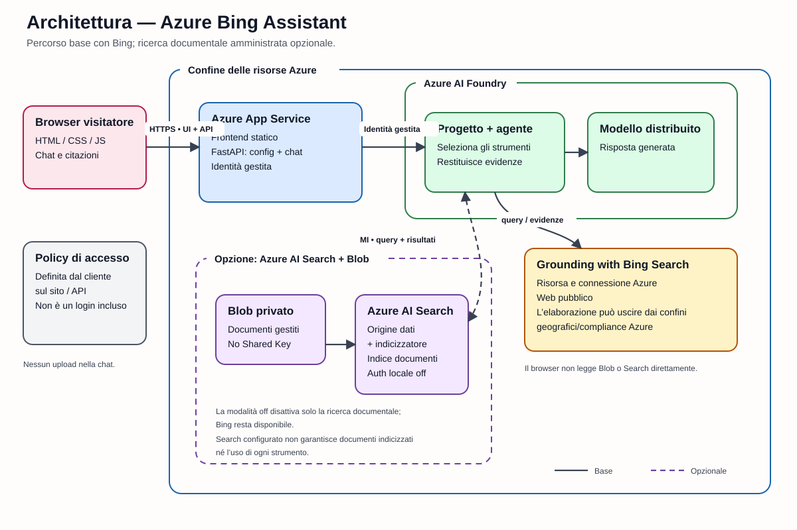
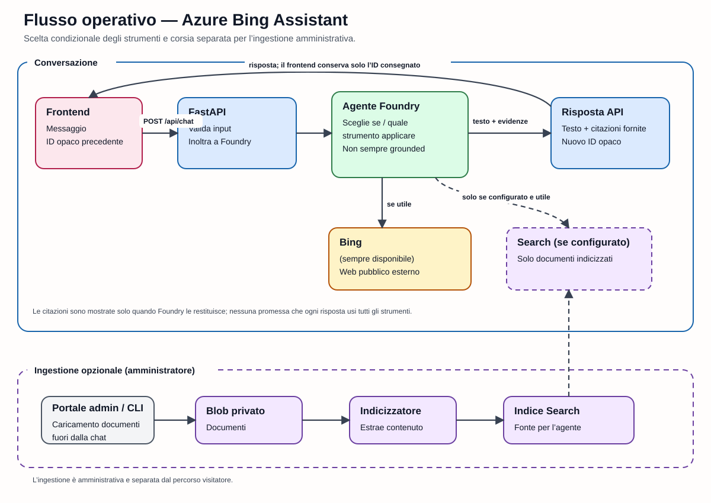
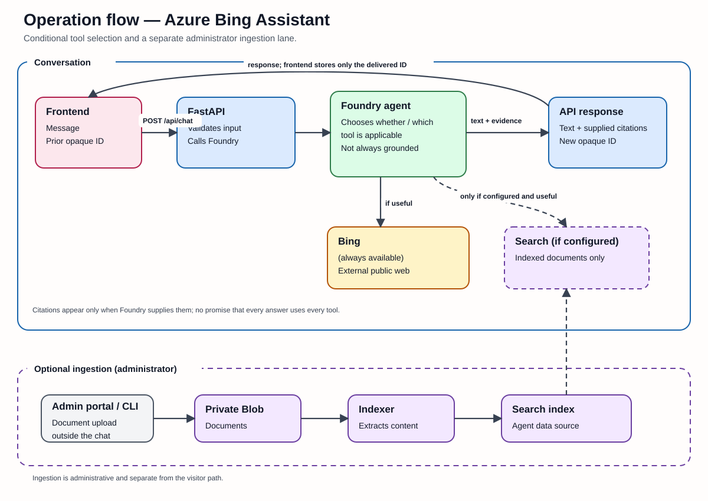

# Architettura / Architecture

[Italiano](#italiano) · [English](#english) · [README](../README.md)

## Italiano

### Vista generale

[Sorgente Excalidraw del grafo](assets/architecture-it.excalidraw)

Il grafo sopra è la rappresentazione di riferimento della distribuzione
attuale. Il percorso `off` crea:

- un piano Linux Basic e un App Service HTTPS con Managed Identity
  `SystemAssigned`;
- un account Microsoft Foundry/AI Services con autenticazione locale
  disabilitata, un progetto con Managed Identity e il deployment del modello
  scelto;
- una risorsa Grounding with Bing Search e la relativa connessione gestita nel
  progetto Foundry;
- role assignment che consente all'identità del web app di usare Foundry.

`searchBlob` conserva tutti questi componenti e aggiunge Storage Standard LRS,
container privato `documents`, Azure AI Search Basic, indicizzatore/indice e
connessione Search al progetto. La Managed Identity di Search legge Blob; quella
del progetto Foundry legge l'indice. In `off` il modulo Storage/Search non viene
creato.

Gli endpoint pubblici restano abilitati per un modello generico, ma ciò non
equivale a rendere anonimi i dati Blob/Search: accesso Blob anonimo, Shared Key e
autenticazione locale Search sono disabilitati. La pagina e `/api/chat`, invece,
sono intenzionalmente pubblici in una nuova installazione finché il cliente non
protegge l'ingresso completo.

### Perché questa tecnologia

Il servizio è intenzionalmente ridotto: Python/FastAPI serve HTML, CSS e
JavaScript vanilla locali. Un framework frontend o un archivio conversazioni
aggiungerebbero complessità senza migliorare il flusso singolo. Foundry Responses
fornisce la continuazione tramite un ID opaco e le identità gestite autorizzano
le chiamate Azure. Non esistono Redis, database di sessione, cookie applicativi,
HMAC, chiavi di firma, lease o lock distribuiti.

### Distribuzione

1. Il wizard usa Azure CLI in sola lettura per sottoscrizioni, resource group,
   regioni, combinazioni modello/SKU e ruoli. Non consulta Microsoft Graph e non
   crea registrazioni per il login dei visitatori.
2. L'installer convalida gli input e compila `infra/main.bicep` su standard
   output, senza file parametri o ARM JSON persistenti.
3. `DefaultAzureCredential` invia una distribuzione subscription-scope
   incrementale ad Azure Resource Manager tramite HTTPS.
4. Gli output non segreti confermati vengono salvati nell'ambiente azd.
5. Il post-deploy crea/aggiorna la versione dell'agente, collega sempre Bing,
   collega Search solo in `searchBlob`, poi azd distribuisce il pacchetto web.

L'identità dell'operatore serve al deployment; la Managed Identity dell'App
Service serve a runtime. Nessuna credenziale dell'operatore viene inserita
nell'app.

### Flusso runtime

[Sorgente Excalidraw del flusso](assets/flow-it.excalidraw)

1. Il browser carica la pagina e `GET /api/config` dallo stesso FastAPI.
2. Con `POST /api/chat` invia JSON con `message` e, dai turni successivi,
   l'eventuale `previousResponseId`.
3. FastAPI convalida lunghezza e caratteri, poi l'adapter asincrono usa
   `AIProjectClient`, `DefaultAzureCredential` e Foundry Responses. Il browser
   non chiama mai direttamente Foundry.
4. L'agente può usare Grounding with Bing Search; in `searchBlob` può anche
   recuperare documenti già indicizzati da Azure AI Search.
5. FastAPI restituisce `message`, citazioni proiettate e il nuovo
   `previousResponseId`. Il browser conserva solo l'ultimo ID in memoria e lo
   invia invariato al turno seguente.

Ogni scheda è indipendente. “New chat” cancella l'ID locale. Cancel annulla la
richiesta browser e preserva l'ultimo ID consegnato; un lavoro già accettato da
Foundry può comunque terminare in best effort. Un ID scaduto produce un errore
limitato e permette di ripartire. Il server non decodifica, firma, associa,
registra o persiste l'ID.

### Citazioni e contenuti non attendibili

Risposte, documenti, web pubblico e metadati di citazione sono input non
attendibili. Il frontend costruisce nodi di testo, non HTML del modello. Per i
documenti privati, il backend elimina titoli/percorsi grezzi e restituisce
riferimenti relativi opachi. URL web e query Bing HTTP(S) validi sono conservati
per i requisiti di visualizzazione; host infrastrutturali Azure noti vengono
scartati.

La presenza dello strumento Bing non prova che ogni risposta abbia effettuato
una ricerca. Analogamente, `searchBlob` prova solo che l'integrazione è
configurata, non che un documento sia stato caricato, indicizzato o recuperato.

### Flusso documenti opzionale

1. Un amministratore con Storage Blob Data Contributor carica file supportati
   nel container privato, fuori dalla chat.
2. L'indicizzatore Azure AI Search usa la propria Managed Identity per leggere
   contenuto e metadati Blob.
3. Il post-deploy crea indice, data source basata su Resource ID e indicizzatore,
   quindi collega lo strumento Search all'agente.
4. L'amministratore controlla stato, errori, conteggio e recupero. La chat non
   espone upload o gestione documenti.

### Confini del grounding web

Questa implementazione usa il `BingGroundingTool` standard sul web pubblico.
I siti preferiti diventano istruzioni consultive, non limiti. Non usa la vecchia
API Bing Web Search standalone e non accetta `BING_SEARCH_KEY`.

Un filtro rigoroso richiederebbe un Bing Custom Search pubblicato e verificato
oppure l'architettura distinta Azure AI Search/Foundry IQ Web Knowledge Source
con `allowedDomains` e knowledge base. Nessuna delle due viene creata qui;
`--strict-websites` fallisce invece di simulare l'applicazione della regola.

### Esclusioni e limiti

Non sono presenti login visitatore, upload chat, allegati, OCR, crawler,
ingestione siti, NFS, source picker, telemetria applicativa, archivio
conversazioni, gateway, WAF, CAPTCHA o rate limiter. Endpoint privati, DNS,
protezione ingresso, diagnostica e retention dipendono dal cliente.

Il progetto usa un'API di progetto Foundry preview e deve essere verificato nel
tenant/area scelti. Grounding with Bing può elaborare query, parametri e
credenziali di servizio fuori dai confini geografici/compliance Azure; il DPA
Microsoft non si applica a tale elaborazione Bing. Non vengono offerte garanzie
di conformità o residenza.

### Riferimenti Microsoft

Riferimenti controllati indipendentemente il 25 agosto 2026:

- [Web grounding overview](https://learn.microsoft.com/azure/foundry/agents/how-to/tools/web-overview)
- [Grounding with Bing tools](https://learn.microsoft.com/azure/foundry/agents/how-to/tools/bing-tools)
- [Web Search and domain-restricted Custom Search](https://learn.microsoft.com/azure/foundry/agents/how-to/tools/web-search)
- [Foundry toolbox supported-tools matrix](https://learn.microsoft.com/azure/foundry/agents/concepts/toolbox-overview#supported-tools)
- [Create an Azure AI Search Web Knowledge Source](https://learn.microsoft.com/azure/search/agentic-knowledge-source-how-to-web)
- [Azure AI Search Web Knowledge Source REST contract](https://learn.microsoft.com/rest/api/searchservice/knowledge-sources/create-or-update?view=rest-searchservice-2026-04-01)
- [Grounding with Bing terms](https://www.microsoft.com/en-us/bing/apis/grounding-legal-enterprise)

---

## English

### Overview

[Excalidraw source for the graph](assets/architecture-en.excalidraw)

The graph above is the reference representation of the current deployment. The
`off` path creates:

- a Linux Basic plan and HTTPS App Service with `SystemAssigned` Managed
  Identity;
- a Microsoft Foundry/AI Services account with local authentication disabled,
  a project with Managed Identity, and the selected model deployment;
- a Grounding with Bing Search resource and managed Foundry project connection;
- a role assignment allowing the web app identity to use Foundry.

`searchBlob` keeps all those components and adds Standard LRS Storage, a private
`documents` container, Basic Azure AI Search, index/indexer, and a Search project
connection. Search Managed Identity reads Blob; Foundry project Managed Identity
reads the index. The Storage/Search module is absent in `off`.

Public endpoints remain enabled for a generic template, but this does not make
Blob/Search data anonymous: anonymous Blob access, Shared Key, and Search local
authentication are disabled. The page and `/api/chat`, however, are
intentionally public in a new installation until the customer protects the
complete ingress.

### Technology rationale

The service is deliberately small: Python/FastAPI serves local vanilla HTML,
CSS, and JavaScript. A frontend framework or conversation database would add
complexity without improving the single-chat flow. Foundry Responses supplies
continuation through an opaque identifier, while managed identities authorize
Azure calls. There is no Redis, session database, application cookie, HMAC,
signing key, lease, or distributed lock.

### Deployment

1. The wizard uses read-only Azure CLI discovery for subscriptions, resource
   groups, regions, model/SKU combinations, and roles. It does not query
   Microsoft Graph or create visitor-login registrations.
2. The installer validates input and compiles `infra/main.bicep` to standard
   output, without persisting parameter files or ARM JSON.
3. `DefaultAzureCredential` sends an incremental subscription-scope deployment
   to Azure Resource Manager over HTTPS.
4. Confirmed non-secret outputs are stored in the azd environment.
5. Post-deploy creates/updates the agent version, always attaches Bing, attaches
   Search only in `searchBlob`, and then azd deploys the web package.

Operator identity is used for deployment; App Service Managed Identity is used
at runtime. Operator credentials are never deployed into the app.

### Runtime flow

[Excalidraw source for the flow](assets/flow-en.excalidraw)

1. The browser loads the page and `GET /api/config` from the same FastAPI app.
2. `POST /api/chat` sends JSON containing `message` and, after the first turn,
   optional `previousResponseId`.
3. FastAPI validates length and characters. The asynchronous adapter then uses
   `AIProjectClient`, `DefaultAzureCredential`, and Foundry Responses. The
   browser never calls Foundry directly.
4. The agent may use Grounding with Bing Search; in `searchBlob`, it may also
   retrieve documents already indexed by Azure AI Search.
5. FastAPI returns `message`, projected citations, and the next
   `previousResponseId`. The browser keeps only the latest ID in memory and
   passes it unchanged on the following turn.

Each tab is independent. “New chat” clears its local ID. Cancel aborts the
browser request while preserving the last delivered ID; work already accepted
by Foundry may still complete on a best-effort basis. An expired ID returns a
bounded error and allows a fresh start. The server does not decode, sign, bind,
log, or persist the ID.

### Citations and untrusted content

Model output, documents, the public web, and citation metadata are untrusted
input. The frontend creates text nodes rather than injecting model HTML. For
private documents, the backend removes raw titles/paths and emits opaque
relative references. Valid HTTP(S) web and Bing-query URLs are retained for
display requirements; known Azure infrastructure hosts are discarded.

Having the Bing tool does not prove that every answer performed a search.
Likewise, `searchBlob` proves only that integration is configured, not that a
document was uploaded, indexed, or retrieved.

### Optional document flow

1. An administrator with Storage Blob Data Contributor uploads supported files
   to the private container outside chat.
2. Azure AI Search's Managed Identity reads Blob content and metadata.
3. Post-deploy creates the index, Resource-ID-based data source, and indexer,
   then attaches the Search tool to the agent.
4. The administrator verifies state, errors, count, and retrieval. Chat exposes
   no upload or document-management surface.

### Web-grounding boundary

This implementation uses standard `BingGroundingTool` against the public web.
Preferred sites become advisory instructions, not restrictions. It does not use
the retired standalone Bing Web Search API and accepts no `BING_SEARCH_KEY`.

Strict filtering would require a published, verified Bing Custom Search or the
distinct Azure AI Search/Foundry IQ Web Knowledge Source architecture with
`allowedDomains` and a knowledge base. Neither is created here;
`--strict-websites` fails rather than simulating enforcement.

### Exclusions and limitations

There is no visitor login, chat upload, attachment, OCR, crawler, website
ingestion, NFS, source picker, application telemetry, conversation store,
gateway, WAF, CAPTCHA, or rate limiter. Private endpoints, DNS, ingress
protection, diagnostics, and retention are customer-specific.

The project uses a preview Foundry project API and requires verification in the
selected tenant/region. Grounding with Bing may process queries, parameters, and
service credentials outside Azure compliance/geographic boundaries; the
Microsoft DPA does not apply to that Bing processing. No compliance or
residency guarantee is provided.

### Microsoft references

References independently checked on August 25, 2026:

- [Web grounding overview](https://learn.microsoft.com/azure/foundry/agents/how-to/tools/web-overview)
- [Grounding with Bing tools](https://learn.microsoft.com/azure/foundry/agents/how-to/tools/bing-tools)
- [Web Search and domain-restricted Custom Search](https://learn.microsoft.com/azure/foundry/agents/how-to/tools/web-search)
- [Foundry toolbox supported-tools matrix](https://learn.microsoft.com/azure/foundry/agents/concepts/toolbox-overview#supported-tools)
- [Create an Azure AI Search Web Knowledge Source](https://learn.microsoft.com/azure/search/agentic-knowledge-source-how-to-web)
- [Azure AI Search Web Knowledge Source REST contract](https://learn.microsoft.com/rest/api/searchservice/knowledge-sources/create-or-update?view=rest-searchservice-2026-04-01)
- [Grounding with Bing terms](https://www.microsoft.com/en-us/bing/apis/grounding-legal-enterprise)
